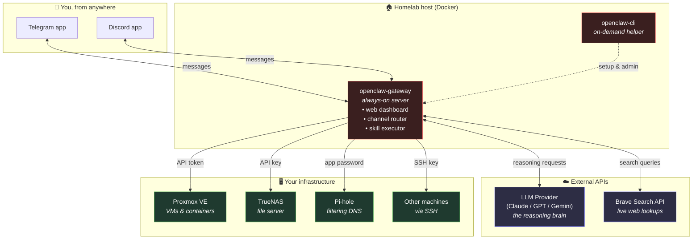

# 🦞 OpenClaw Homelab

> A self-hosted AI ops agent that lets you **monitor and control your entire homelab from a chat message.** Ask it how your Proxmox cluster is doing, tell it to restart a container, check what your DNS filter blocked today, or wake a sleeping server — all from Telegram or Discord, from anywhere.

This repository contains a Dockerized [OpenClaw](https://github.com/openclaw/openclaw) deployment wired up to common homelab infrastructure: a Proxmox virtualization host, a TrueNAS file server, and a Pi-hole filtering DNS. It is designed to be cloned, configured with your own credentials, and brought up with a single `docker compose up`.

---

## What is this?

OpenClaw is an open-source AI agent platform. It connects a large language model (the "brain") to messaging channels (Telegram, Discord, and others) and to **skills** — small modules that let the agent take real actions like calling an API or running an SSH command.

This project packages OpenClaw as two containers and connects it to your homelab so that a plain-language message such as *"restart the VM that's hung"* gets translated by the LLM into the correct API call against your infrastructure.

```
You (phone)  ──►  Telegram/Discord  ──►  OpenClaw  ──►  your homelab
                                            │
                                  decides what to do
                                  using the LLM brain
```

---

## Architecture



### How a request flows

1. You message the bot: *"How much RAM is free on the Proxmox host?"*
2. Telegram/Discord delivers the message to the **gateway**.
3. The gateway sends the message to your **LLM provider**, along with the list of available skills.
4. The LLM decides to call the Proxmox skill and returns that decision.
5. The gateway executes the skill — an authenticated call to the Proxmox API.
6. The result goes back to the LLM, which writes a human answer.
7. The answer is delivered back to you in the chat.

---

## Why two API tokens?

This is the part that trips up newcomers, so it's worth being explicit. The agent needs **two different kinds of external access**, and they do completely different jobs.

### 1. LLM provider token — *required*

This is the agent's **reasoning engine**. OpenClaw does not contain an AI model itself; it routes your messages to a provider and uses the response to decide what to do. Without this token the agent cannot interpret your messages or choose which skill to run. You bring your own key and pay the provider directly for usage.

| Provider | Where to get a key | Notes |
|----------|-------------------|-------|
| Anthropic (Claude) | [console.anthropic.com](https://console.anthropic.com) | Strong at agent/tool workflows |
| OpenAI (GPT) | [platform.openai.com](https://platform.openai.com) | Mature, widely supported |
| Google (Gemini) | [aistudio.google.com](https://aistudio.google.com) | Has a usable free tier |
| OpenRouter | [openrouter.ai](https://openrouter.ai) | One key, many models |

> **Cost note:** an agent uses far more tokens than a normal chatbot because each task can trigger several model calls (read context, choose a tool, interpret the result, write a reply). **Set a monthly spending limit** in your provider's dashboard before you start.

### 2. Web search token — *optional*

The LLM only knows what it was trained on. To answer questions about *current* things — a new CVE, the latest version of a package, today's news — the agent needs to search the live web. The **Brave Search API** key enables this. Without it the agent still works, but it can't look anything up online.

Get a key at [brave.com/search/api](https://brave.com/search/api). If you'd rather not pay or share queries with a third party, you can self-host [SearXNG](https://github.com/searxng/searxng) instead (not included in this compose file, but easy to add).

### Everything else: infrastructure credentials

These are **not** the same as the two API tokens above. They are the keys, tokens, and passwords that let the agent actually *act* on your homelab:

- **Proxmox API token** — list/start/stop/snapshot VMs and containers
- **TrueNAS API key** — check pools, datasets, and shares
- **Pi-hole app password** — view stats, enable/disable blocking
- **A dedicated SSH key** — run arbitrary shell commands on machines that don't have a tidy API

---

## Prerequisites

- A Linux host (bare metal, VM, or WSL2) with **Docker** and the **Docker Compose plugin**
- At least **2 GB RAM** available to the container
- An API key from one LLM provider (see above)

---

## Quick start

```bash
# 1. Clone and enter the project
https://github.com/AmEr-v/OpenClaw_Homelab.git
cd openclaw-homelab

# 2. Create your config and workspace directories
mkdir -p config workspace
sudo chown -R 1000:1000 config workspace

# 3. Copy the templates and fill them in
cp .env.example .env
cp ssh_config.example ssh_config
openssl rand -hex 32          # paste the output as OPENCLAW_GATEWAY_TOKEN
nano .env                     # add your paths, gateway token, and LLM key
nano ssh_config               # add your machines (only if using SSH skills)

# 4. Pull the image
docker compose pull

# 5. Run the onboarding wizard (picks provider, validates key)
docker compose run --rm --no-deps --entrypoint node openclaw-gateway \
  dist/index.js onboard --mode local --no-install-daemon

# 6. Start the gateway
docker compose up -d openclaw-gateway
```

> **Note on `gateway.bind=lan`:** when the dashboard is exposed to your LAN, OpenClaw requires you to declare which origins may connect. For a private homelab the simplest fix is the host-header fallback:
> ```bash
> docker compose run --rm openclaw-cli config set \
>   gateway.controlUi.dangerouslyAllowHostHeaderOriginFallback true
> ```
> Only do this on a trusted private network.

Open the dashboard at `http://<host-ip>:18789` and paste your gateway token to connect.

---

## Connecting a chat channel

### Telegram

1. In Telegram, message **@BotFather**, send `/newbot`, and follow the prompts. Save the token it gives you.
2. Register the bot:
   ```bash
   docker compose run --rm openclaw-cli channels add \
     --channel telegram --token "YOUR_BOT_TOKEN"
   ```
3. Message your new bot. It will reply with a **pairing code**. Approve it:
   ```bash
   docker compose run --rm openclaw-cli pairing approve telegram THE_CODE
   ```
4. **Lock it down** so only you can use it. Get your numeric ID from **@userinfobot**, then:
   ```bash
   docker compose run --rm openclaw-cli config set \
     channels.telegram.allowFrom '[YOUR_NUMERIC_ID]' --strict-json
   ```

### Discord

Create an application and bot at the [Discord Developer Portal](https://discord.com/developers/applications), copy the bot token, then register it the same way with `--channel discord`. Restrict access with an allowlist of user IDs.

---

## Installing infrastructure skills

```bash
# Proxmox: manage VMs and containers
docker compose run --rm openclaw-cli skills add openclaw/skills --skill proxmox-full

# Pi-hole: control DNS filtering
docker compose run --rm openclaw-cli skills add openclaw/skills --skill pihole

# Reload so the new skills register
docker compose restart openclaw-gateway
```

After installing, fill in the matching credentials in `.env` and recreate the gateway (`docker compose down && docker compose up -d`).

---

## Example things you can ask

Once everything is connected, message your bot:

- *"What's the status of my Proxmox host?"*
- *"Start the VM called media-server."*
- *"How many queries did Pi-hole block in the last hour?"*
- *"Disable DNS filtering for 5 minutes."*
- *"Check free space on the TrueNAS pool."*
- *"SSH into the backup box and show me disk usage."*
- *"Search the web for the latest Proxmox security advisory."*

---

## Security notes

Running an AI agent with access to your infrastructure is powerful and carries real risk. Treat this like any privileged automation:

- **Isolate it.** Run the agent on a dedicated VM or LXC, not on a machine holding sensitive personal files or credentials.
- **Scope every credential to least privilege.** If the agent only needs to read Proxmox status, don't give it an admin token. Create a scoped API token instead.
- **Restrict the SSH key.** Use a dedicated key (never your personal one). Consider `authorized_keys` command restrictions on the target machines.
- **Lock the channel.** Always set an `allowFrom` allowlist so random people who discover your bot can't issue commands.
- **Don't expose the dashboard to the internet.** Keep it on your LAN and reach it remotely through a VPN or mesh network (e.g. Tailscale / WireGuard), not a public port.
- **Set a spending cap** on your LLM provider account.
- **Review skills before installing them.** A skill is code that runs with your credentials.

---

## Repository layout

```
openclaw-homelab/
├── docker-compose.yml      # the two-container stack
├── .env.example            # credential template — copy to .env
├── ssh_config.example      # SSH hosts template — copy to ssh_config
├── .gitignore              # keeps secrets out of git
└── README.md               # this file
```

Files that are intentionally **not** in the repo (they're gitignored because they hold secrets or runtime state): `.env`, `ssh_config`, `config/`, `workspace/`.

---

## License

Released under the MIT License. OpenClaw itself is a separate project with its own license; see [github.com/openclaw/openclaw](https://github.com/openclaw/openclaw).

---

## Acknowledgements

Built on [OpenClaw](https://github.com/openclaw/openclaw). Infrastructure integrations rely on the public Proxmox VE, TrueNAS, and Pi-hole APIs.
